<!--Copyright 2024 The HuggingFace Team. All rights reserved.

Licensed under the Apache License, Version 2.0 (the "License"); you may not use this file except in compliance with
the License. You may obtain a copy of the License at

http://www.apache.org/licenses/LICENSE-2.0

Unless required by applicable law or agreed to in writing, software distributed under the License is distributed on
an "AS IS" BASIS, WITHOUT WARRANTIES OR CONDITIONS OF ANY KIND, either express or implied. See the License for the
specific language governing permissions and limitations under the License.

⚠️ Note that this file is in Markdown but contain specific syntax for our doc-builder (similar to MDX) that may not be
rendered properly in your Markdown viewer.

-->

# Technical Architecture

This document provides a comprehensive overview of the Transformers library's technical architecture, design patterns, and implementation details. It serves as a technical reference for developers, researchers, and contributors who want to understand how Transformers works under the hood.

## 🏛️ Overall System Architecture

Transformers is built on a layered architecture that promotes modularity, extensibility, and framework interoperability. The system consists of several key layers:

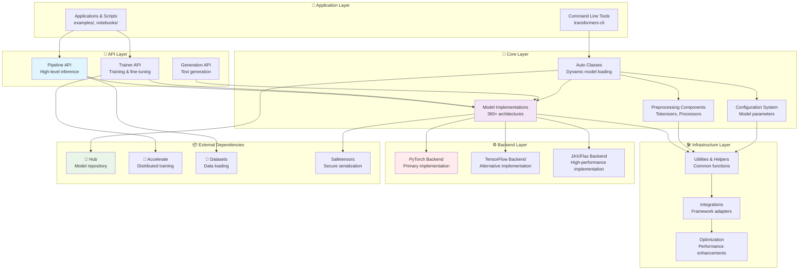

## 🧩 Core Components Architecture

### 1. Model Architecture Pattern

All models in Transformers follow a consistent three-component architecture:

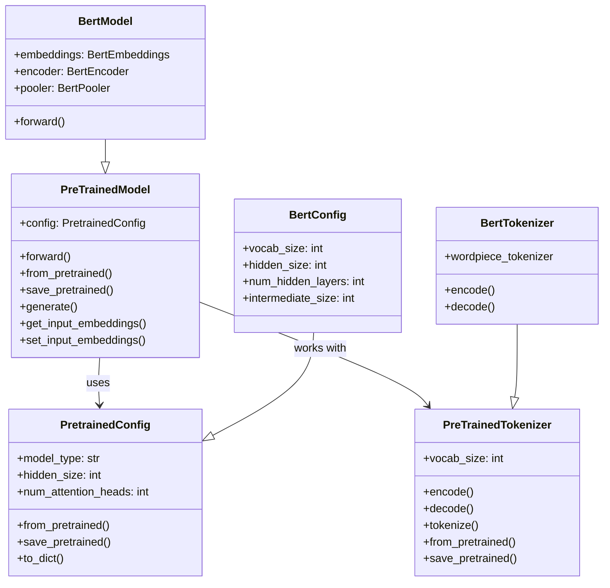

### 2. Auto Classes System

The Auto Classes provide a unified interface for loading models dynamically:

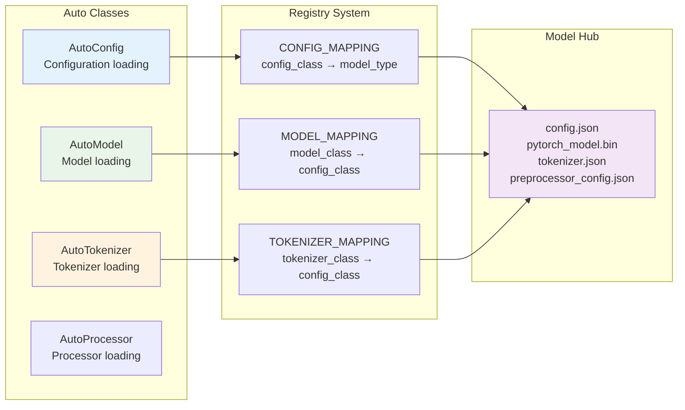

## 🔄 Model Lifecycle & Data Flow

### 1. Model Loading Flow

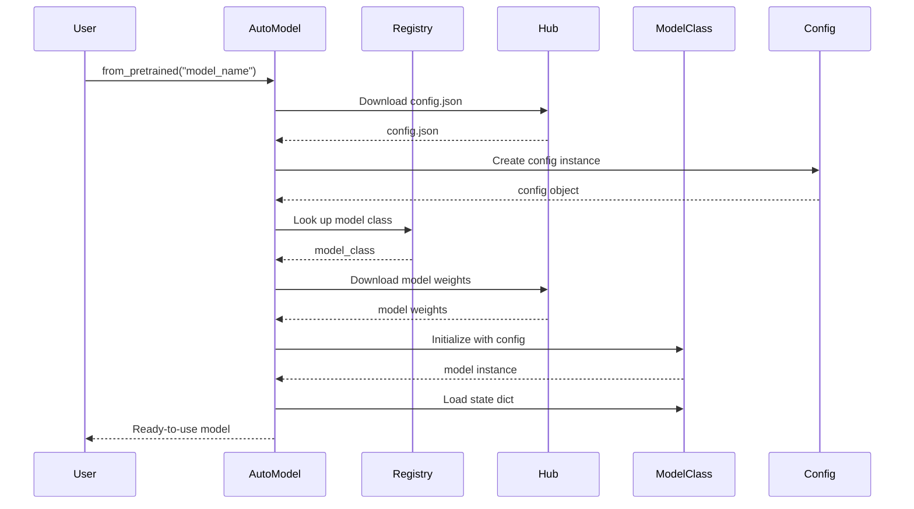

### 2. Training Pipeline Flow

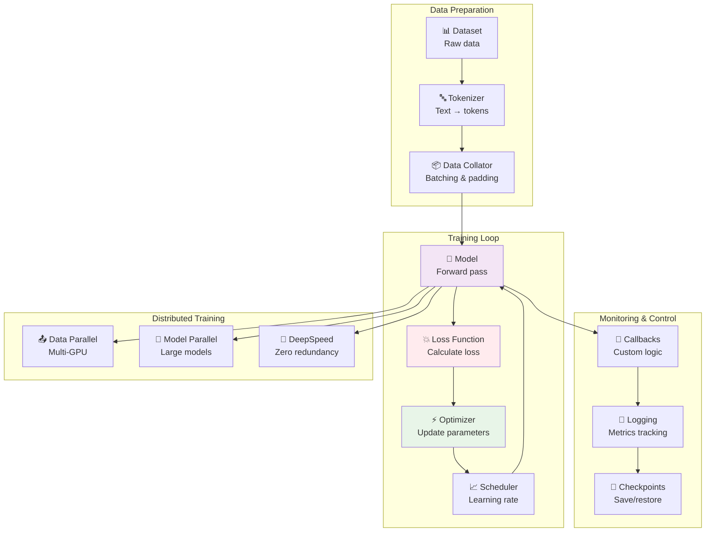

### 3. Inference Pipeline Flow

```mermaid
graph LR
    subgraph "Input Processing"
        RawInput[📝 Raw Input<br/>Text/Image/Audio]
        Preprocessor[⚙️ Preprocessor<br/>Tokenize/Normalize]
        Tensors[🔢 Tensors<br/>Model inputs]
    end
    
    subgraph "Model Forward Pass"
        Embeddings[📊 Embeddings<br/>Input representation]
        Layers[🔄 Transformer Layers<br/>Attention + FFN]
        OutputHead[🎯 Output Head<br/>Task-specific]
    end
    
    subgraph "Output Processing"
        RawOutput[📈 Raw Outputs<br/>Logits/Predictions]
        Postprocessor[🎛️ Postprocessor<br/>Decode/Format]
        FinalOutput[✨ Final Output<br/>Human-readable]
    end
    
    RawInput --> Preprocessor
    Preprocessor --> Tensors
    Tensors --> Embeddings
    Embeddings --> Layers
    Layers --> OutputHead
    OutputHead --> RawOutput
    RawOutput --> Postprocessor
    Postprocessor --> FinalOutput
    
    style Preprocessor fill:#e3f2fd
    style Layers fill:#f3e5f5
    style Postprocessor fill:#e8f5e8
```

## 🔀 Multi-Framework Support

Transformers supports multiple ML frameworks through a unified interface:

```mermaid
graph TB
    subgraph "Unified Model Interface"
        ModelAPI[Common Model API<br/>forward(), generate(), etc.]
    end
    
    subgraph "Framework Implementations"
        PyTorchImpl[🔥 PyTorch Implementation<br/>modeling_*.py]
        TFImpl[🧮 TensorFlow Implementation<br/>modeling_tf_*.py] 
        FlaxImpl[⚡ JAX/Flax Implementation<br/>modeling_flax_*.py]
    end
    
    subgraph "Framework-Specific Features"
        PyTorchFeatures[🔥 PyTorch Features<br/>• Autograd<br/>• TorchScript<br/>• torch.compile]
        TFFeatures[🧮 TF Features<br/>• tf.function<br/>• SavedModel<br/>• TF Serving]
        FlaxFeatures[⚡ JAX Features<br/>• XLA compilation<br/>• Gradient transformation<br/>• Vectorization]
    end
    
    subgraph "Conversion Utilities"
        PyTorchToTF[PyTorch → TF<br/>Weight conversion]
        TFToPyTorch[TF → PyTorch<br/>Weight conversion]
        FlaxToPyTorch[Flax → PyTorch<br/>Weight conversion]
    end
    
    ModelAPI --> PyTorchImpl
    ModelAPI --> TFImpl
    ModelAPI --> FlaxImpl
    
    PyTorchImpl --> PyTorchFeatures
    TFImpl --> TFFeatures
    FlaxImpl --> FlaxFeatures
    
    PyTorchImpl <--> PyTorchToTF
    TFImpl <--> TFToPyTorch
    FlaxImpl <--> FlaxToPyTorch
    
    style ModelAPI fill:#e1f5fe
    style PyTorchImpl fill:#ffebee
    style TFImpl fill:#e8f5e8
    style FlaxImpl fill:#fff3e0
```

## 🚀 Performance Optimizations

### 1. Attention Optimizations

```mermaid
graph TD
    subgraph "Attention Mechanisms"
        StandardAttn[Standard Attention<br/>O(n²) complexity]
        FlashAttn[⚡ Flash Attention<br/>Memory-efficient]
        PagedAttn[📄 Paged Attention<br/>KV caching]
        SparseAttn[🕸️ Sparse Attention<br/>Reduced complexity]
    end
    
    subgraph "Hardware Acceleration"
        CUDA[🔥 CUDA Kernels<br/>GPU optimization]
        ROCm[🏔️ ROCm<br/>AMD GPU support]
        Metal[🍎 Metal<br/>Apple Silicon]
        CPU[🖥️ CPU Optimizations<br/>SIMD instructions]
    end
    
    subgraph "Framework Integration"
        SDPABackend[SDPA Backend<br/>PyTorch 2.0+]
        CustomKernels[Custom Kernels<br/>Triton/CUDA]
        CompileMode[torch.compile<br/>JIT compilation]
    end
    
    StandardAttn --> FlashAttn
    StandardAttn --> PagedAttn
    StandardAttn --> SparseAttn
    
    FlashAttn --> CUDA
    FlashAttn --> ROCm
    FlashAttn --> Metal
    StandardAttn --> CPU
    
    FlashAttn --> SDPABackend
    FlashAttn --> CustomKernels
    FlashAttn --> CompileMode
    
    style FlashAttn fill:#e8f5e8
    style CUDA fill:#ffebee
    style SDPABackend fill:#e3f2fd
```

### 2. Memory Management

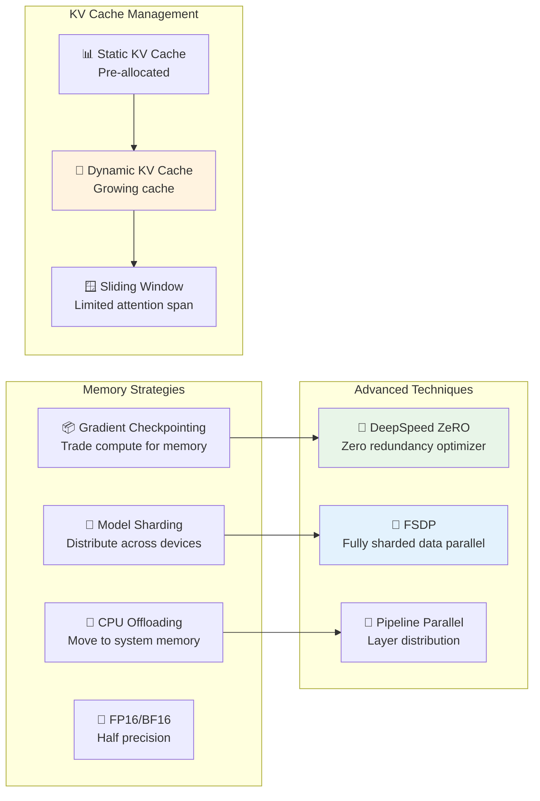

## 🌐 Ecosystem Integration

### 1. Training Framework Integration

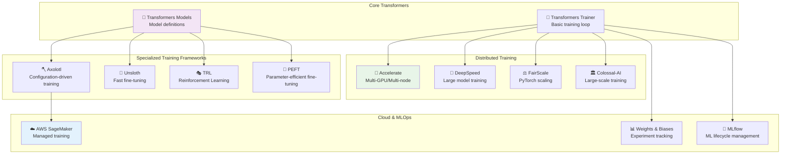

### 2. Inference Engine Integration

```mermaid
graph TB
    subgraph "Model Definition"
        HFModels[🤗 Transformers Models<br/>Standard model definitions]
    end
    
    subgraph "High-Throughput Inference"
        vLLM[⚡ vLLM<br/>Fast LLM serving]
        TGI[🚀 Text Generation Inference<br/>Production serving]
        SGLang[🔤 SGLang<br/>Structured generation]
        TensorRT[🏎️ TensorRT-LLM<br/>NVIDIA optimization]
    end
    
    subgraph "Edge Deployment"
        ONNX[📦 ONNX<br/>Cross-platform inference]
        TorchScript[🔥 TorchScript<br/>PyTorch deployment]
        TFLite[📱 TensorFlow Lite<br/>Mobile inference]
        CoreML[🍎 Core ML<br/>Apple deployment]
    end
    
    subgraph "Specialized Backends"
        LlamaCpp[🦙 llama.cpp<br/>CPU-optimized inference]
        MLX[🍎 MLX<br/>Apple Silicon]
        Candle[🕯️ Candle<br/>Rust implementation]
        GGML[⚡ GGML<br/>Quantized inference]
    end
    
    HFModels --> vLLM
    HFModels --> TGI
    HFModels --> SGLang
    HFModels --> TensorRT
    
    HFModels --> ONNX
    HFModels --> TorchScript
    HFModels --> TFLite
    HFModels --> CoreML
    
    HFModels --> LlamaCpp
    HFModels --> MLX
    HFModels --> Candle
    HFModels --> GGML
    
    style HFModels fill:#f3e5f5
    style vLLM fill:#e8f5e8
    style ONNX fill:#e3f2fd
    style LlamaCpp fill:#fff3e0
```

## 📁 Code Organization

### Directory Structure

```
transformers/
├── 📁 src/transformers/          # Main library code
│   ├── 📁 models/               # Model implementations (360+ models)
│   │   ├── 📁 bert/            # BERT model files
│   │   │   ├── configuration_bert.py
│   │   │   ├── modeling_bert.py
│   │   │   ├── modeling_tf_bert.py
│   │   │   ├── modeling_flax_bert.py
│   │   │   └── tokenization_bert.py
│   │   └── ...                 # Other model directories
│   ├── 📁 pipelines/           # High-level Pipeline API
│   ├── 📁 generation/          # Text generation utilities
│   ├── 📁 quantizers/          # Model quantization
│   └── 📄 *.py                 # Core utilities and base classes
├── 📁 tests/                   # Comprehensive test suite
├── 📁 examples/                # Example scripts and notebooks
├── 📁 docs/                    # Documentation source
└── 📁 utils/                   # Development utilities
```

### Model Implementation Pattern

Each model follows a consistent file structure:

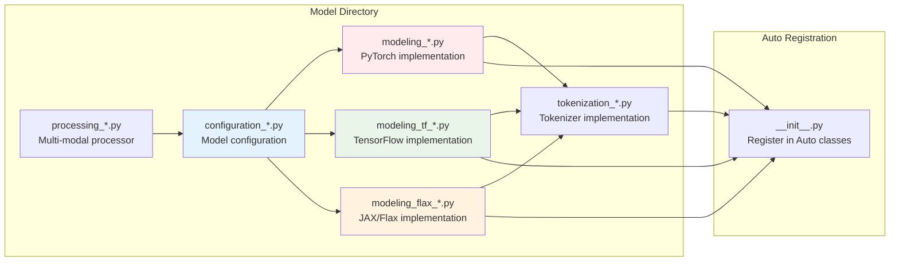

## 🔧 Development Patterns

### 1. Modular vs. Copied Code

Transformers uses two main approaches for code organization:

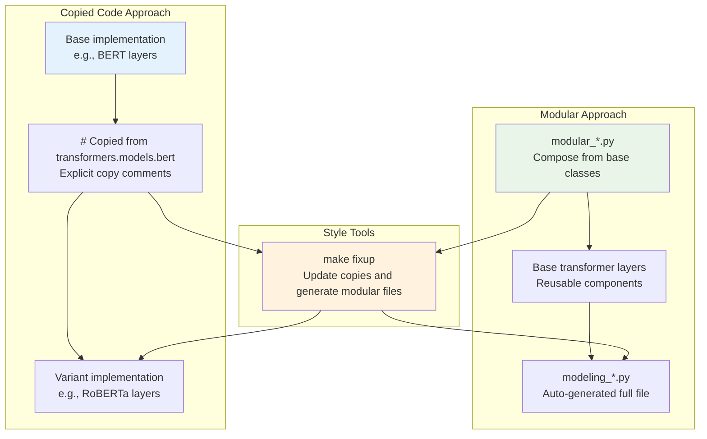

### 2. Testing Strategy

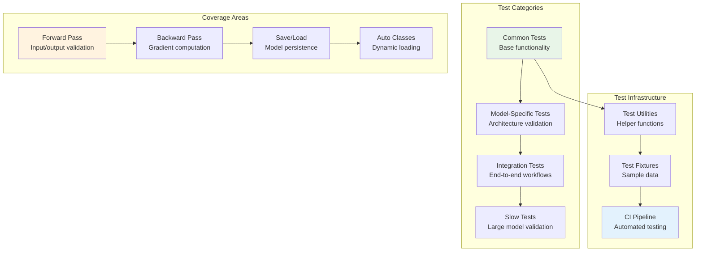

## 🔍 Advanced Features

### 1. Dynamic Module Loading

Transformers supports loading custom models from remote repositories:

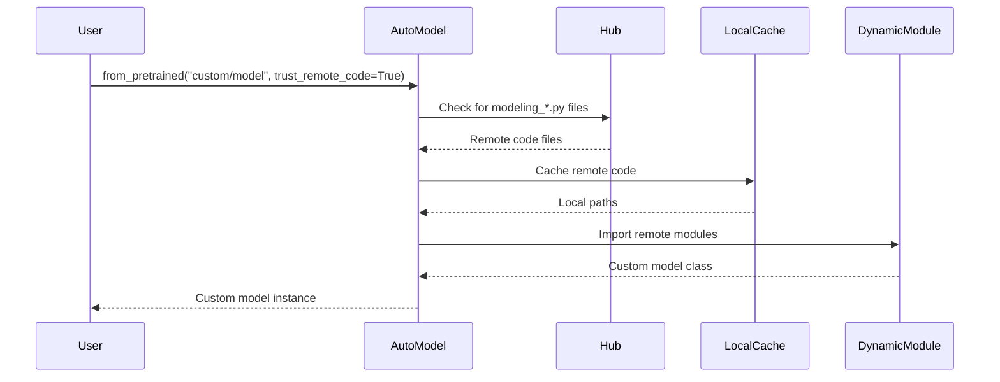

### 2. Quantization Support

```mermaid
graph LR
    subgraph "Quantization Methods"
        FP16[Half Precision<br/>FP16/BF16]
        INT8[8-bit Quantization<br/>LLM.int8()]
        INT4[4-bit Quantization<br/>QLoRA/GPTQ]
        AWQ[Activation-aware<br/>AWQ]
    end
    
    subgraph "Quantization Libraries"
        BitsAndBytes[🔢 bitsandbytes<br/>CUDA quantization]
        AutoGPTQ[⚡ auto-gptq<br/>GPTQ implementation]
        AutoAWQ[🔧 autoawq<br/>AWQ implementation]
        Optimum[🚀 Optimum<br/>Intel/ONNX quantization]
    end
    
    subgraph "Hardware Targets"
        GPU[🔥 GPU<br/>CUDA/ROCm]
        CPU[🖥️ CPU<br/>Intel/AMD]
        Mobile[📱 Mobile<br/>ARM/Edge]
    end
    
    FP16 --> BitsAndBytes
    INT8 --> BitsAndBytes
    INT4 --> AutoGPTQ
    AWQ --> AutoAWQ
    
    BitsAndBytes --> GPU
    AutoGPTQ --> GPU
    AutoAWQ --> GPU
    Optimum --> CPU
    Optimum --> Mobile
    
    style INT4 fill:#e8f5e8
    style BitsAndBytes fill:#e3f2fd
    style GPU fill:#ffebee
```

## 📚 Documentation & Resources

For more detailed information, refer to:

- [Philosophy](./philosophy): Core design principles and goals
- [Models](./models): How to load and use models
- [Pipeline Tutorial](./pipeline_tutorial): High-level API usage
- [Training](./training): Fine-tuning and training guides
- [Performance](./llm_optims): Optimization techniques
- [Contributing](./contributing): How to contribute to the library

This technical architecture guide provides the foundation for understanding how Transformers works internally. The modular design, consistent patterns, and extensive ecosystem integration make it a powerful framework for both research and production use cases.